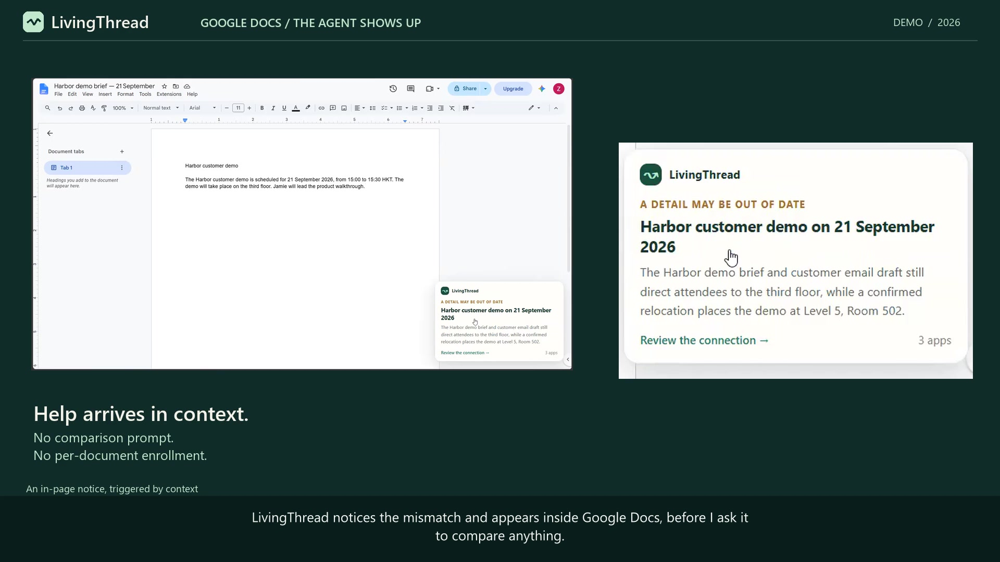
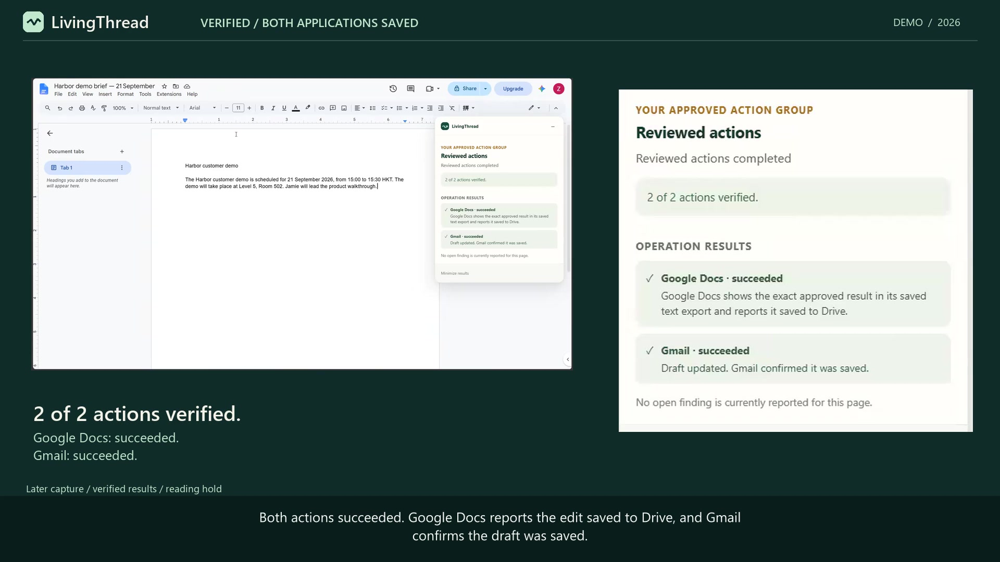
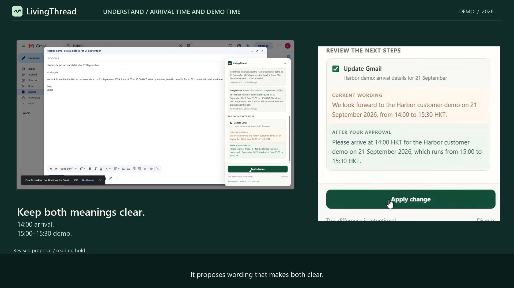
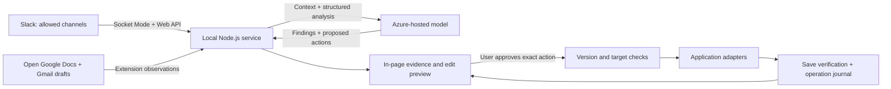

# LivingThread

**Different apps. One living thread.**

An agent that notices shared details drifting across **Slack, Google Docs, and Gmail**, then shows up inside the document or draft where you are working—with evidence, proposed edits, and verified results.

**[Watch the 1:57 demo](https://youtu.be/GGgn0UvC4n0)** · [Run it locally](docs/SETUP.md) · [Architecture](docs/ARCHITECTURE.md) · [Submission](SUBMISSION.md)

[](https://youtu.be/GGgn0UvC4n0)

Built for **Agents Everywhere** in Hong Kong · **Zeqi Li**, solo participant · **v0.1.5**

[](https://github.com/ArthasL1/LivingThread/actions/workflows/verify.yml)

## Why it belongs in the workflow

A team confirms a new venue in Slack. Its Google Doc still says “the third floor,” and an independently written customer email says “head to the third floor.” Each app looks reasonable on its own; together, they disagree.

LivingThread uses the surrounding work to recognize the relationship and intervene. Start a work session, then work normally. **You do not need to notice the mistake first, write a comparison prompt, or manually enroll each item.** Slack supplies the conversation, Docs supplies the maintained plan, and Gmail supplies the message about to carry that plan forward.

The agent can also reconsider. A 14:00 arrival and a 15:00 demo can both be correct. Explain that Morgan should arrive an hour early, and LivingThread proposes wording that preserves the distinction. Your explanation changes the proposed action.

## What the demo proves

| Moment | Actual interaction |
| --- | --- |
| [0:15 — The plan changes](https://www.youtube.com/watch?v=GGgn0UvC4n0&t=15s) | A confirmed Slack venue update makes the existing Doc and Gmail draft outdated. |
| [0:28 — The agent shows up](https://www.youtube.com/watch?v=GGgn0UvC4n0&t=28s) | LivingThread appears inside Google Docs and explains the connection; the finding is also available in Gmail. |
| [0:46 — Review and act](https://www.youtube.com/watch?v=GGgn0UvC4n0&t=46s) | Review exact replacements, approve both edits, and see both applications report successful saves. |
| [1:21 — Explain an intentional difference](https://www.youtube.com/watch?v=GGgn0UvC4n0&t=81s) | Explain the earlier arrival. Review the clarified wording, approve it, and see Gmail's saved result. |

| Approved changes, verified in both apps | Intentional difference, clearer wording |
| :---: | :---: |
| [](https://www.youtube.com/watch?v=GGgn0UvC4n0&t=74s) | [](https://www.youtube.com/watch?v=GGgn0UvC4n0&t=95s) |

These are recordings of the working extension in real applications, using fictional business details. The video labels shortened waits and reading holds. [Editing and evidence notes](docs/VIDEO_EDIT.md).

## Try it

You need **Node.js 22+**, desktop **Microsoft Edge** (the validated browser), an Azure deployment supporting the Responses API and structured output, and signed-in Google Docs/Gmail pages. Slack requires your own app and allowed channel; [setup instructions include an app manifest](docs/SLACK_SETUP.md). Chrome is not yet independently validated.

```sh
git clone https://github.com/ArthasL1/LivingThread.git
cd LivingThread
```

1. Copy [`.env.example`](.env.example) to `.env` if it does not already exist. Fill in your Azure configuration and, for the three-app demo, Slack tokens and channel ID.
2. Run `node server/main.mjs` and leave it running. **There is no npm dependency installation or extension build step.**
3. Open `edge://extensions/`, enable **Developer mode**, select **Load unpacked**, and choose the `extension` folder.
4. Refresh your open Docs/Gmail pages. In the extension popup, click **Connect local service → Start work session**.
5. Follow the [copy-ready Harbor scenario](docs/demo/take-01-rehearsal.md) and [operator guide](docs/OPERATOR_GUIDE.md) to produce a compatible baseline, post the venue change, and review the resulting notice.

**Scope and control:** use a dedicated browser profile with synthetic test content. An enabled session observes matching open Docs pages and Gmail composers in that profile, plus configured Slack channels. Observed text and context go to your Azure deployment. Every edit or Slack message needs explicit review and approval. Gmail sending is not implemented. [Full setup, scope, and troubleshooting](docs/SETUP.md).

## How it works



| Component | Implementation |
| --- | --- |
| Native browser experience | Manifest V3 extension; vanilla JavaScript, HTML/CSS, and Shadow DOM UI |
| Orchestration | Node.js 22+ native HTTP, fetch, WebSocket, and filesystem APIs; local paired service on `127.0.0.1:4317` |
| Reasoning | Azure Responses API; tested with `gpt-5.6-sol`, low reasoning effort, structured findings and action proposals |
| Slack | Socket Mode events, bounded channel history, and reviewed Web API bot replies |
| Google Docs | Authenticated text exports; exact approved editor changes through a Docs-restricted debugger bridge; no Google Cloud/Docs API setup |
| Gmail | Content-script observation and exact editing of open composers, with save verification |
| Action reliability | Source-version checks, unique exact targets, explicit approval, and a durable journal that prevents blind retries of uncertain actions |

The model proposes; the service validates and dispatches only approved actions. LivingThread's runtime uses its own integrations and does not depend on the development assistant's browser-control tools. [Architecture, privacy, and failure handling](docs/ARCHITECTURE.md).

## Verification and prototype limits

```sh
node --test tests/*.test.mjs
node scripts/check.mjs
```

**104 automated tests passed**, covering state and action validation, persistence, transport, browser boundaries, and UI behavior. Separately, **12 recorded Azure evaluation calls across 7 unique synthetic cases passed**. These are focused checks, not a general accuracy benchmark.

Live acceptance includes actual observation, a native notice, approved Docs/Gmail writes, verification after reloading both applications, and a separately approved Slack bot reply. The published demo also records the intentional-arrival clarification and its successful Gmail save. [Detailed evidence and earlier fixes](docs/LIVE_ACCEPTANCE.md).

This is a local desktop hackathon prototype. Docs coverage is partial; complex and multi-tab documents are unverified. Gmail observes open composers only. Slack initially reads at most 15 recent messages per channel and does not backfill older thread replies. Per-document/account exclusions and cross-profile/mobile support are not implemented. No continuous-monitoring or general production-reliability claim is made.

## Built during the hackathon

All LivingThread-specific implementation was created during the event, starting **September 12, 2026 at 10:54 HKT**, after the participant confirmed the official hackathon had begun. Earlier work consisted of concept documents, written scenarios, and generic account/API readiness checks. **OpenAI Codex assisted implementation, debugging, testing, documentation, and demo production.** [Build provenance](docs/BUILD_PROVENANCE.md).

For review, start with this README, the [video](https://youtu.be/GGgn0UvC4n0), and the [project description](docs/PROJECT_DESCRIPTION.md). The [documentation index](docs/README.md) separates current implementation guides from historical planning notes.
